# Wildmap — 完整用戶流程圖

> 使用 Mermaid 語法，可在 GitHub 直接渲染。

---

## A. 認證流程

### A1. Email 註冊 → 登入 → 忘記密碼

```mermaid
flowchart TD
    Start([用戶進入平台]) --> HasAccount{有帳號？}

    HasAccount -->|否| Register[點擊「註冊」Tab]
    Register --> FillReg[填寫：顯示名稱 + Email + 密碼 + 確認密碼]
    FillReg --> ValidReg{表單驗證}
    ValidReg -->|名稱為空| ErrName[❌ 請輸入顯示名稱]
    ValidReg -->|密碼 < 6 字| ErrPwd[❌ 密碼至少需要 6 個字元]
    ValidReg -->|密碼不一致| ErrMatch[❌ 密碼不一致]
    ValidReg -->|Email 已註冊| ErrDup[❌ 此 Email 已註冊]
    ValidReg -->|通過| SubmitReg[送出註冊]
    ErrName --> FillReg
    ErrPwd --> FillReg
    ErrMatch --> FillReg
    ErrDup --> FillReg
    SubmitReg --> RegSuccess[✅ 註冊成功，導向首頁]

    HasAccount -->|是| Login[點擊「登入」Tab]
    Login --> FillLogin[填寫：Email + 密碼]
    FillLogin --> ValidLogin{驗證}
    ValidLogin -->|帳號密碼錯誤| ErrLogin[❌ 登入失敗]
    ValidLogin -->|成功| LoginSuccess[✅ 登入成功，導向首頁]
    ErrLogin --> FillLogin

    FillLogin --> Forgot[點擊「忘記密碼？」]
    Forgot --> ForgotPage[/forgot-password 頁面]
    ForgotPage --> FillEmail[填寫 Email]
    FillEmail --> SendReset[寄送重設密碼信]
    SendReset --> CheckInbox[📧 提示用戶檢查信箱]
    CheckInbox --> BackLogin[返回登入頁]
```

### A2. Google OAuth 登入

```mermaid
flowchart TD
    Start([用戶點擊「使用 Google 帳號繼續」]) --> Redirect[跳轉至 Google 授權頁]
    Redirect --> Auth{Google 授權}
    Auth -->|拒絕| Cancel[返回登入頁]
    Auth -->|同意| Callback[/auth/callback 處理回調]
    Callback --> Exchange[exchangeCodeForSession]
    Exchange --> IsNew{第一次登入？}
    IsNew -->|是| CreateProfile[自動建立 users profile<br/>display_name = Google 名稱<br/>avatar_url = Google 頭像<br/>level = 1, points = 0]
    IsNew -->|否| Skip[略過]
    CreateProfile --> Home[✅ 導向首頁]
    Skip --> Home
```

### A3. 手機登入（未來）

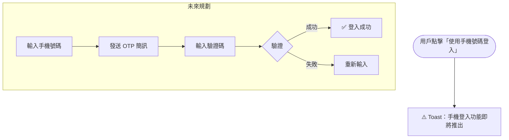

### A4. 登出

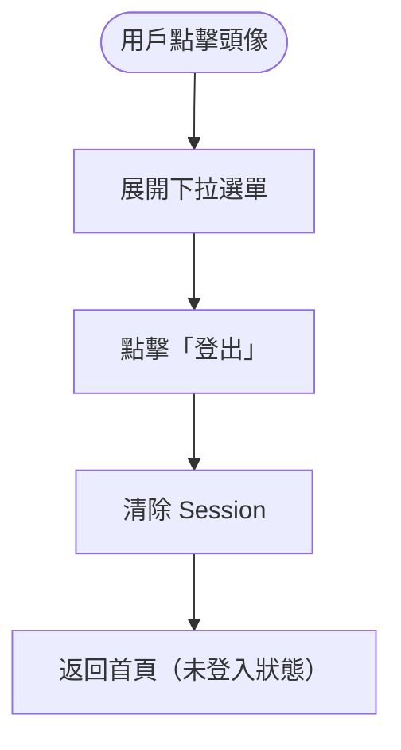

---

## B. 地圖瀏覽流程

### B1. 首頁地圖 → 篩選 → 點地標 → 看詳情

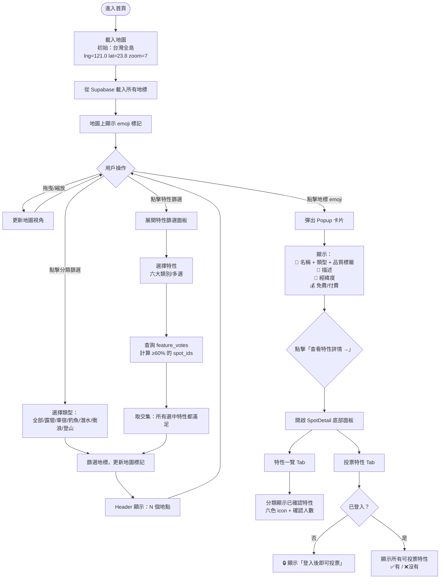

### B2. 特性篩選細節

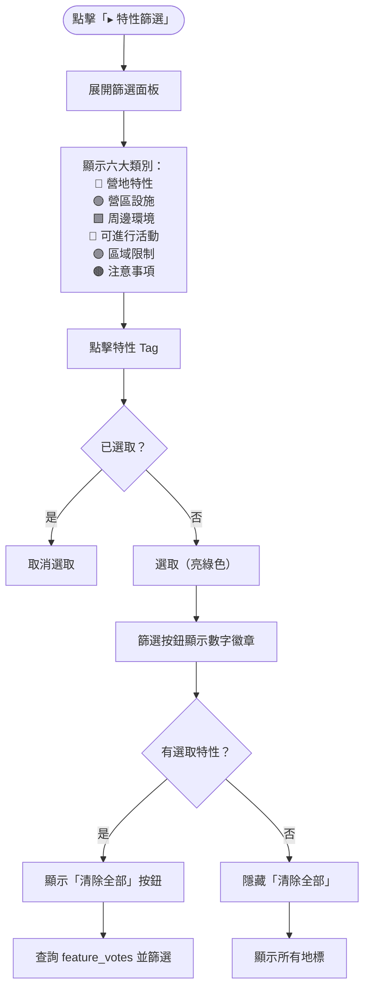

---

## C. 地標管理流程

### C1. 新增地標

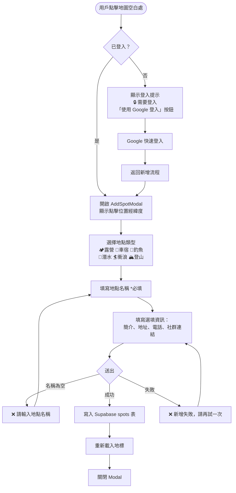

### C2. 編輯地標（中期）

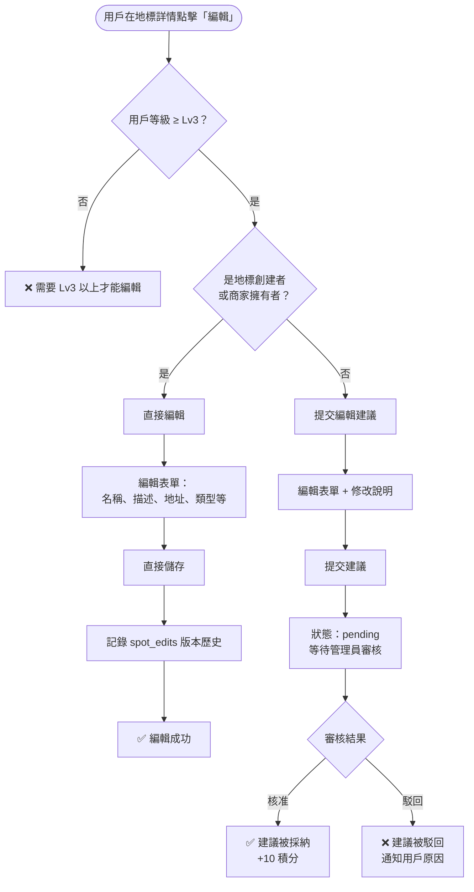

### C3. 地標生命週期

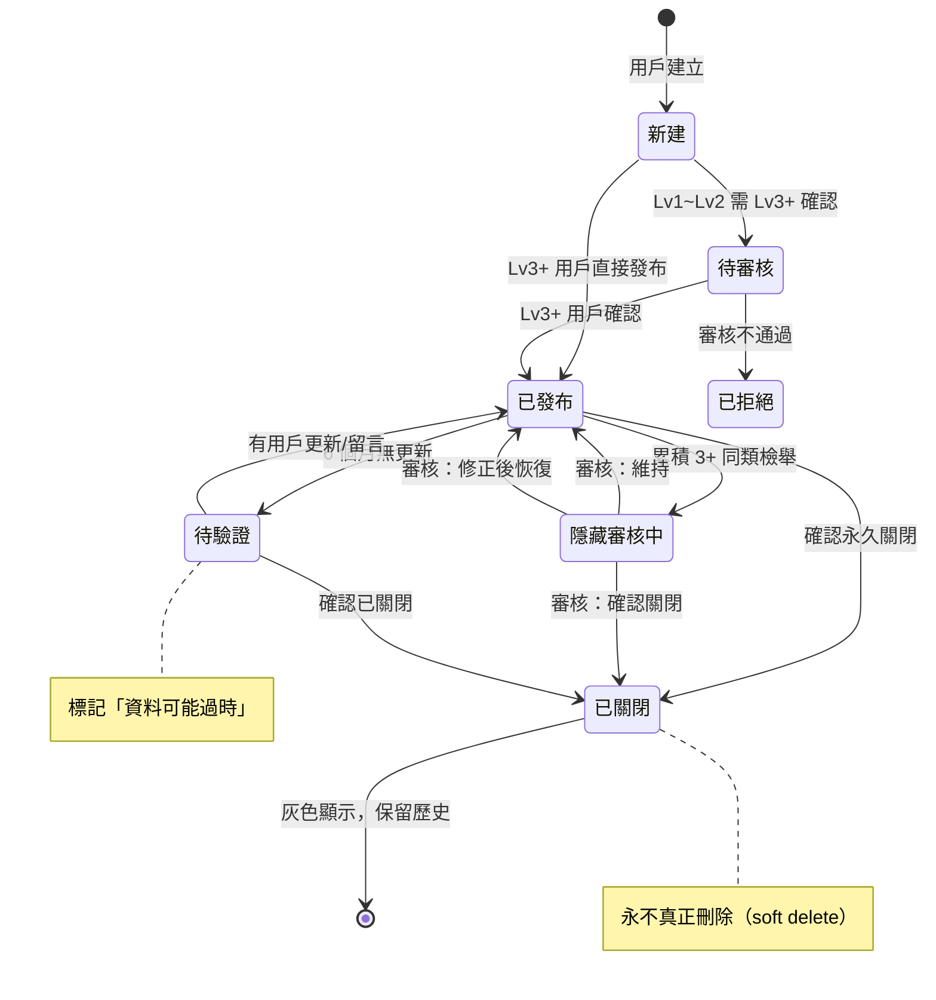

---

## D. 特性投票流程

### D1. 投票特性

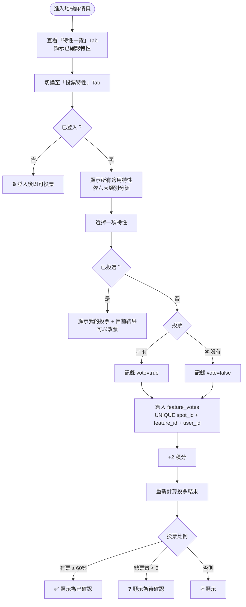

### D2. 回報錯誤特性

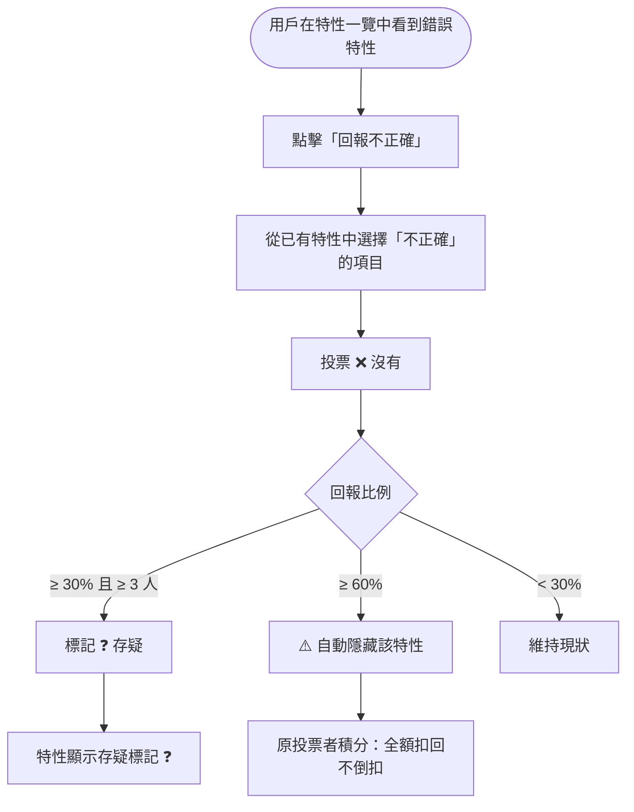

---

## E. 用戶互動流程（MVP-B）

### E1. 評分

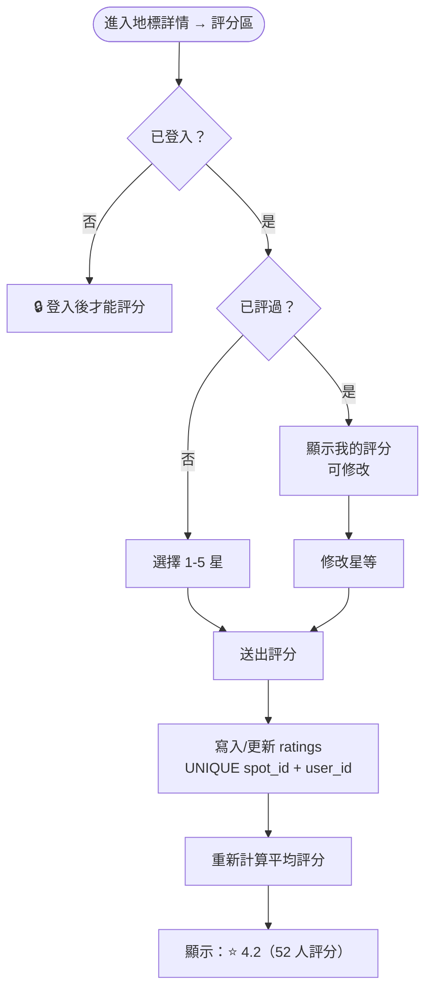

### E2. 留言

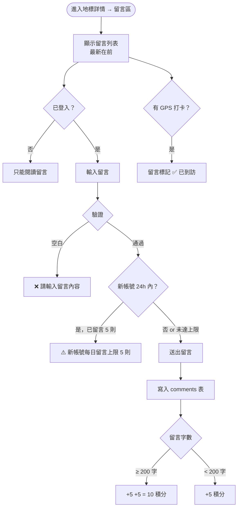

### E3. 上傳照片（= 打卡）

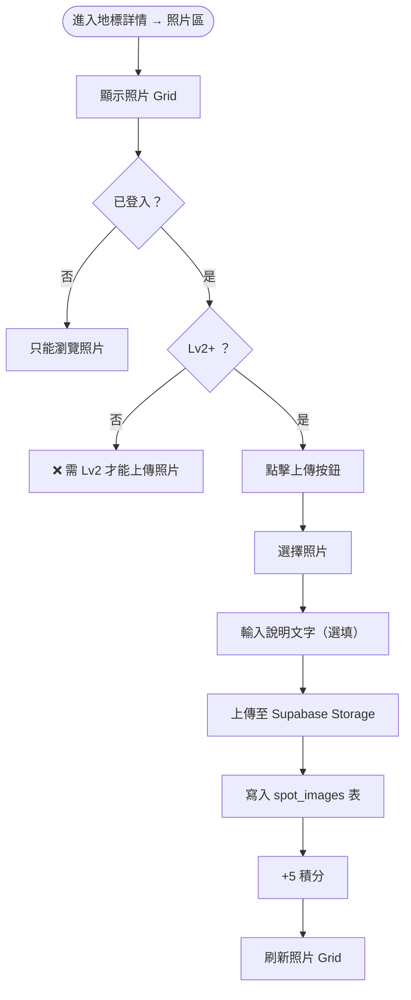

### E4. 撰寫遊記（中期）

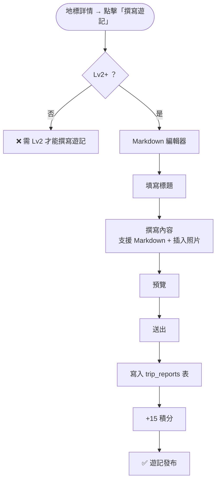

### E5. 收藏地標（中期）

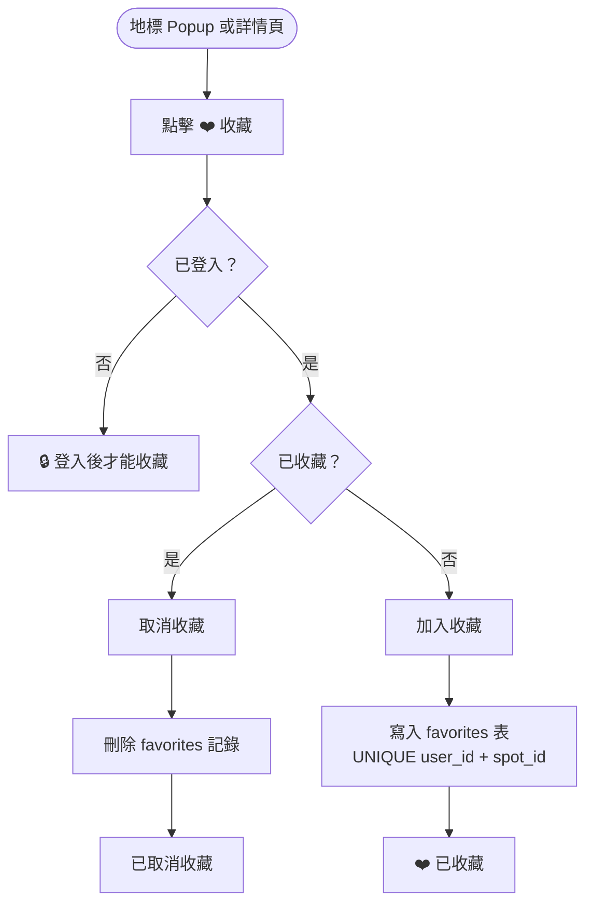

---

## F. 個人頁面流程

### F1. 查看個人頁面

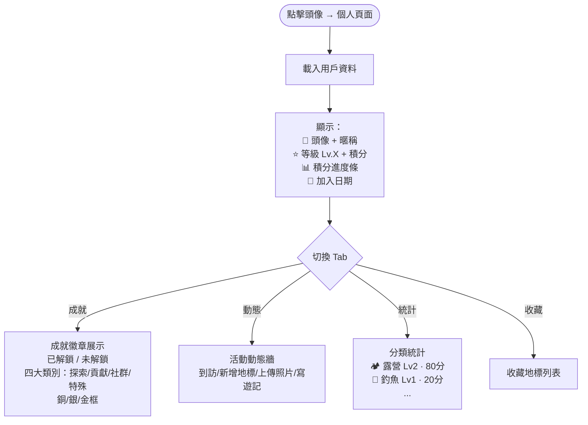

### F2. 追蹤其他用戶（中期）

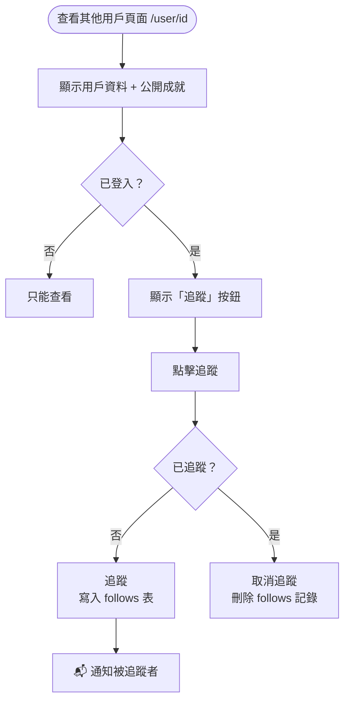

---

## G. 商家流程（遠期）

### G1. 聲明擁有權

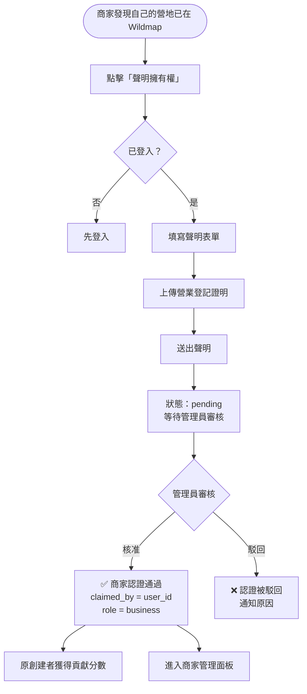

### G2. 商家訂閱

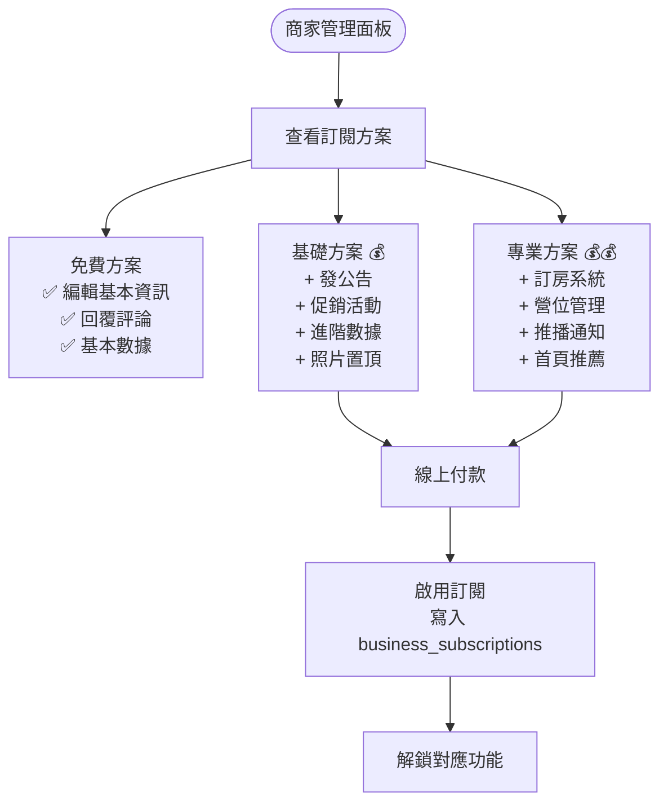

### G3. 訂房系統（遠期）

```mermaid
flowchart TD
    Start([用戶進入營地詳情]) --> HasBooking{營地有開放訂房？}
    HasBooking -->|否| NoBooking[無訂房功能]
    HasBooking -->|是| ViewCalendar[查看可訂日期]

    ViewCalendar --> SelectDate[選擇日期]
    SelectDate --> SelectSite[選擇營位]
    SelectSite --> FillInfo[填寫訂房資訊<br/>人數、需求等]
    FillInfo --> Confirm[確認訂單]
    Confirm --> Payment[線上付款]
    Payment --> BookingSuccess[✅ 訂房成功<br/>📬 通知商家 + 用戶]
```

---

## H. 管理員流程

### H1. 處理檢舉

```mermaid
flowchart TD
    Start([管理員進入 /admin/reports]) --> LoadQueue[載入檢舉佇列]
    LoadQueue --> ShowList[顯示待處理檢舉列表<br/>按時間排序]
    ShowList --> SelectReport[選擇一則檢舉]

    SelectReport --> ViewDetail[查看檢舉詳情：<br/>📋 檢舉類型<br/>📝 檢舉描述<br/>🎯 被檢舉對象<br/>👤 檢舉者]

    ViewDetail --> Action{處理決定}
    Action -->|維持| Dismiss[駁回檢舉<br/>status = dismissed]
    Action -->|修正| Fix[修正內容<br/>status = resolved]
    Action -->|刪除| Remove[隱藏/刪除內容<br/>status = resolved]

    Fix --> NotifyReporter[📬 通知檢舉者：已處理]
    Remove --> NotifyReporter
    Remove --> NotifyOwner[📬 通知內容擁有者：被移除]
    Dismiss --> NotifyReporter

    NotifyReporter --> AddReporterPoints[檢舉被確認有效 +5 積分]
```

### H2. 審核商家認證

```mermaid
flowchart TD
    Start([管理員進入 /admin/business]) --> LoadClaims[載入待審核聲明]
    LoadClaims --> ShowList[顯示聲明列表]
    ShowList --> SelectClaim[選擇一則聲明]

    SelectClaim --> ViewProof[查看：<br/>📄 營業登記證明<br/>🏕️ 對應地標<br/>👤 申請者]

    ViewProof --> Decision{審核決定}
    Decision -->|核准| Approve[✅ 核准<br/>claimed_by = user_id<br/>user.role = business]
    Decision -->|駁回| Reject[❌ 駁回<br/>填寫原因]

    Approve --> NotifyBusiness[📬 通知商家]
    Reject --> NotifyBusiness
```

### H3. 管理用戶

```mermaid
flowchart TD
    Start([管理員進入 /admin/users]) --> SearchUser[搜尋用戶<br/>Email / 暱稱 / ID]
    SearchUser --> ViewUser[查看用戶詳情：<br/>等級、積分、活動紀錄]
    ViewUser --> Action{管理操作}

    Action -->|警告| SendWarning[📬 發送警告通知]
    Action -->|封鎖| BlockUser[封鎖帳號<br/>積分歸零]
    Action -->|解鎖| UnblockUser[解除封鎖]
    Action -->|調整等級| ChangeLevel[手動調整等級/積分]
```

---

## I. 全域流程：自動化規則

```mermaid
flowchart TD
    subgraph 防弊系統
        NewAccount[新帳號 24h 內] --> Limit[限制：最多 2 個地標 + 5 則留言]
        SameIP[同 IP 大量新增] --> AutoFlag[自動標記審核]
        ExtremeRating[連續全 1 星或全 5 星] --> Filter[極端評分過濾]
        DailyPoints[每日積分] --> Cap[上限 100 分]
    end

    subgraph 自動升級
        Points[積分累積] --> Check{檢查等級}
        Check -->|≥ 50| Lv2[升級 Lv2 開拓者]
        Check -->|≥ 200| Lv3[升級 Lv3 嚮導]
        Check -->|≥ 500| Lv4[升級 Lv4 守護者]
        Check -->|≥ 1000| Lv5[升級 Lv5 先驅者]
    end

    subgraph 地標品質自動升級
        NewSpot[🟡 新建] -->|3+ 人投票| Verified[🟢 社群驗證<br/>投票者各 +5 分]
        Verified -->|10+ 人驗證 + 照片 + 評分| Featured[⭐ 精選<br/>創建者 +30 分]
    end

    subgraph 檢舉自動化
        Reports[同地標累積 3 則同類檢舉] --> AutoHide[自動隱藏<br/>進入審核佇列]
    end
```

---

*最後更新：2026-03-04*
